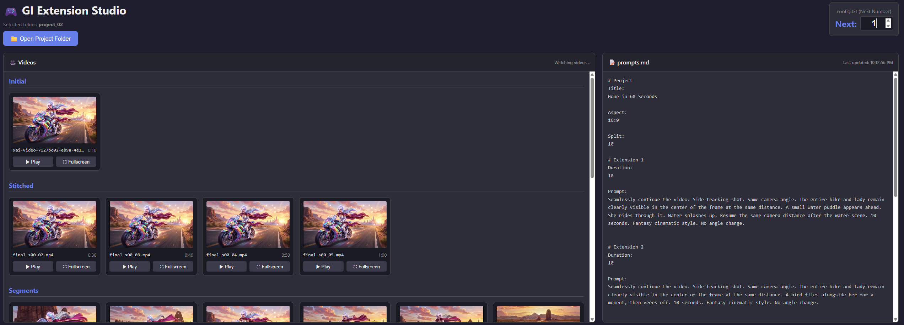

# GI Extension Studio
GI Extension Studio is a streamlined, human-in-the-loop workflow that extends Grok Imagine videos beyond the standard 30-second limit by repeatedly applying a "Split and Stitch" method together with the Grok Imagine API, Node.js CLI tools, and a local web UI for reviewing and managing video segments.



## How It Works (In Principle)

1. Start with an initial video segment (`S00.mp4`)
2. Upload it to Vercel Blob Storage
3. Call the Grok Imagine Extension API to extend the given video
4. Split and stitch the new extension with previous segments
5. Repeat the loop to build seamless long‑form videos

## Demo Video Created with GI Extension Studio

**Gone in 60 Seconds**

[](https://x.com/DavidLi36143625/status/2043661099464331638?s=20)

## Links

For a complete understanding of the workflow, please read these guides first:

- [User Guide on X](https://x.com/DavidLi36143625/status/2043669773142434163)
- [Setup Guide on Medium](https://medium.com/@davidlfliang/guide-setting-up-gi-extension-studio-for-grok-imagine-video-4b0f36bc119d)

[Follow me on X](https://x.com/DavidLi36143625) for more video examples.

## Prerequisites

- [Grok Imagine API](https://console.x.ai/) (developer account + API key)
- [Vercel Blob Storage](https://vercel.com/new) (public access + access token)
- [Node.js](https://nodejs.org/)
- [FFmpeg](https://ffmpeg.org/) (installed locally)
- Basic familiarity with CLI and editing config files

## Quick Setup

### 1. Download the source code

Download the ZIP file from: https://github.com/jdbsolution/GIExtStudio

Extract all files into your project main folder.

### 2. Install dependencies

Navigate to your project main folder and run:

npm install

### 3. Configure `.env`

Create a `.env` file:

```env
GROK_API_KEY=your_grok_api_key_here
BLOB_READ_WRITE_TOKEN=your_blob_read_write_token_here
```

### 4. Set your Vercel blob URL

Edit `extend.js`:

```js
const baseUrl = "https://YOUR_VERCEL_BLOB_URL_HERE/video/";
```

### 5. Set FFmpeg paths

Edit `split.js` and `stitch.js`:

```js
const ffmpegPath = 'C:\\your\\path\\ffmpeg.exe';
const ffprobePath = 'C:\\your\\path\\ffprobe.exe';
```

## Project Structure

```
project-root/
├── extend.js
├── split.js
├── stitch.js
├── upload.js
├── index.html
└── project_01/            ← your project folder
    ├── input/             ← initial video(s)
    ├── raw/               ← generated extensions (archive)
    ├── segments/          ← working segments (S00.mp4, S01.mp4, ...)
    ├── stitched/          ← final merged videos
    ├── prompts.md         ← extension durations + prompts
    ├── config.txt         ← current extension step
    └── story.txt          ← optional storyboard notes
```

## Workflow (one extension cycle)

```bash
# 1. Upload current working segment
node upload.js project_01

# 2. Extend via Grok API
node extend.js project_01

# 3. Split & stitch new segment
node split.js project_01

# 4. Update config.txt for next round
# Change "Next: 1" → "Next: 2"
```

Then repeat steps 1–4 until all planned extensions are done.

## `prompts.md` template

```markdown
# Project
Title: My Project
Aspect: 1:1
Split: 10
Quality: 480P

# Extension 1
Duration: 10
Prompt: Seamlessly continue the video.

# Extension 2
Duration: 10
Prompt: Seamlessly continue the video.
```

## `config.txt` template

```
Next: 1
```

## Web UI

Open `index.html` in your browser to monitor video segments across `input/`, `raw/`, `segments/`, and `stitched/`.

## Important notes

- Bad takes are still saved in `raw/` — you can reuse them elsewhere
- You can change prompts between runs by editing `prompts.md`

## Credits

If you share videos made with this tool, please use the hashtag **#GIExtensionStudio** and consider sharing your `prompts.md`.


